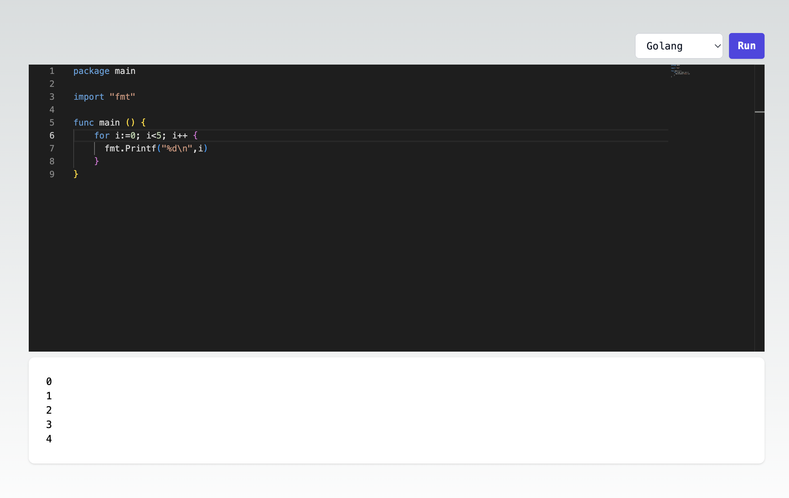

## Arbitrary Code Execution Demo



Have you ever wondered what happens behind the scenes when you hit "Run" on a code snippet in online development environments like [Go Playground](https://go.dev/play/) or [Repl.it](https://replit.com/)?

## Detailed instructions 

[https://dev.to/acoh3n/lets-build-a-code-execution-engine-4kgi](https://dev.to/acoh3n/lets-build-a-code-execution-engine-4kgi)

## Running the demo

You'll need:

- [Go](https://golang.org/) version 1.19 or better installed.
- Docker 

Start the server:

```bash
go run main.go run standalone
```

Execute a code snippet. Example

```bash
curl \
  -s \
  -X POST \
  -H "content-type:application/json" \
  -d '{"language":"python","code":"print(\"hello world\")"}' \
  http://localhost:8000/execute
```

Should output:

```bash
hello world
```

You can try changing the `language` to `go` or `bash`.

## Frontend 

```shell
cd frontend
npm i
npm run dev
```


